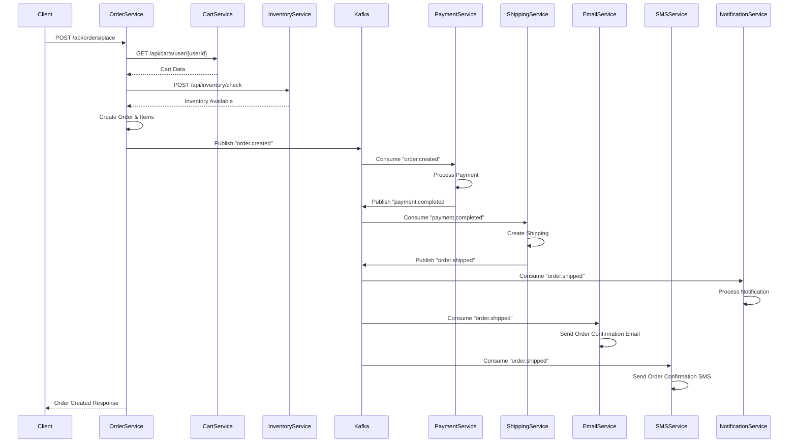

# 🛒 Complete Order Processing Flow - Event-Driven Architecture

## 📋 Table of Contents
1. [Order Flow Overview](#order-flow-overview)
2. [Detailed Step-by-Step Process](#detailed-step-by-step-process)
3. [Kafka Event Publishing](#kafka-event-publishing)
4. [Kafka Event Consumption](#kafka-event-consumption)
5. [Notification Services Integration](#notification-services-integration)
6. [Error Handling & Rollback](#error-handling--rollback)
7. [Code Examples](#code-examples)

---

## 🎯 Order Flow Overview

The order processing follows an **Event-Driven Architecture** where each step publishes events to Kafka topics, and various microservices consume these events to perform their specific tasks.

### High-Level Flow
```
User Request → Cart Validation → Inventory Check → Order Creation → 
Payment Processing → Shipping → Notifications (Email/SMS)
```

### Services Involved
- **order-service** (Port 8085) - Orchestrates the entire flow
- **cart-service** (Port 8091) - Manages shopping cart
- **InventoryService** (Port 8090) - Stock validation
- **PaymentService** (Port 8092) - Payment processing
- **ShippingService** (Port 8093) - Shipping management
- **email-notification-service** (Port 8095) - Email notifications
- **sms-notification-service** (Port 8096) - SMS notifications
- **NotificationService** (Port 8094) - Notification orchestration

---

## 🔄 Detailed Step-by-Step Process

### Step 1: Order Request Initiation
```http
POST /api/orders/place
Content-Type: application/json

{
  "userId": "user-123",
  "shippingAddress": "123 Main St, City, State",
  "paymentMethod": "CREDIT_CARD"
}
```

**Controller Code:**
```java
@PostMapping("/place")
public ResponseEntity<?> placeOrderFromCart(@RequestBody OrderRequest request) {
    log.info("🚀 [API] Request received to place order for user: {}", request.getUserId());
    OrderResponse response = orderService.placeOrderFromCart(request);
    return ExceptionUtil.createBuildResponse(response, HttpStatus.CREATED);
}
```

### Step 2: User Validation
```java
// OrderServiceImpl.java
log.info("🔎 [Step 2] Validating user existence for userId: {}", userId);
UserResponse user = userHttpClient.getUserById(userId);
if (user == null) {
    throw new EntityNotFoundException("User not found: " + userId);
}
```

### Step 3: Cart Retrieval & Validation
```java
// OrderServiceImpl.java
log.info("🛒 [Step 3] Fetching cart for user: {}", userId);
CartResponse cart = fetchValidCart(userId);

private CartResponse fetchValidCart(String userId) {
    CartResponse cart = cartHttpClient.getCartByUserId(userId).getData();
    if (cart == null || cart.getItems().isEmpty()) {
        throw new BadApiRequestException("Cart is empty. Cannot place order.");
    }
    return cart;
}
```

**HTTP Call to Cart Service:**
```java
@HttpExchange
public interface CartHttpClient {
    @GetExchange("/user/{userId}")
    ApiResponse<CartResponse> getCartByUserId(@PathVariable String userId);
}
```

### Step 4: Product Validation & Inventory Check
```java
// OrderServiceImpl.java
log.info("🔍 [Step 4] Validating products and inventory");
List<CartItemResponse> validatedItems = validateAndReserveInventory(cart.getItems());

public List<CartItemResponse> validateAndReserveInventory(List<CartItemResponse> items) {
    // Parallel fetch product details
    Map<String, ProductResponse> productMap = fetchAndValidateProducts(items);
    
    List<CartItemResponse> reservedItems = new ArrayList<>();
    
    for (CartItemResponse item : items) {
        ProductResponse product = productMap.get(item.getProductId());
        
        // Validate product existence, price match, quantity
        orderValidator.validateCartItem(item, product);
        
        // Check inventory availability
        inventoryService.validateAndReserveItem(item);
        
        reservedItems.add(item);
    }
    
    return reservedItems;
}
```

**Inventory Validation:**
```java
// InventoryService.java
public void validateAndReserveItem(CartItemResponse item) {
    InventoryRequest request = new InventoryRequest(item.getProductId(), item.getQuantity());
    InventoryResponse response = inventoryHttpClient.checkInventory(request);
    
    if (!response.isAvailable()) {
        log.error("❌ Inventory unavailable for product: {}", item.getProductId());
        throw new BadApiRequestException("Inventory not available for product: " + item.getProductId());
    }
    
    log.debug("✅ Inventory available for product: {}", item.getProductId());
}
```

### Step 5: Order Creation
```java
// OrderServiceImpl.java
log.info("📝 [Step 5] Creating order entity");
Order order = Order.builder()
    .id(idGeneratorClient.generateId("ORDER").getData())
    .userId(userId)
    .status(OrderStatus.CREATED)
    .totalAmount(calculateTotalAmount(validatedItems))
    .shippingAddress(request.getShippingAddress())
    .paymentMethod(request.getPaymentMethod())
    .createdAt(LocalDateTime.now())
    .build();

Order savedOrder = orderRepository.save(order);
```

### Step 6: Order Items Creation
```java
// OrderServiceImpl.java
log.info("🧩 [Step 6] Creating order items");
List<OrderItem> orderItems = createOrderItems(savedOrder, validatedItems);

private List<OrderItem> createOrderItems(Order order, List<CartItemResponse> cartItems) {
    return cartItems.stream().map(cartItem -> {
        OrderItemRequest itemRequest = OrderItemRequest.builder()
            .productId(cartItem.getProductId())
            .productName(cartItem.getProductName())
            .price(cartItem.getPrice())
            .quantity(cartItem.getQuantity())
            .build();
            
        OrderItemResponse createdItem = orderItemService.addOrderItem(order.getId(), itemRequest);
        OrderItem entity = modelMapper.map(createdItem, OrderItem.class);
        entity.setOrder(order);
        
        return entity;
    }).collect(Collectors.toList());
}
```

### Step 7: Kafka Event Publishing - Order Created
```java
// OrderServiceImpl.java
log.info("📡 [Step 7] Publishing OrderCreatedEvent to Kafka");
orderEventPublisher.publishOrderCreatedEvent(finalOrder);
```

---

## 📡 Kafka Event Publishing

### OrderEventPublisher Implementation
```java
@Component
@RequiredArgsConstructor
public class OrderEventPublisher {
    
    private final KafkaTemplate<String, Object> kafkaTemplate;
    private final ModelMapper modelMapper;
    
    // 1. Order Created Event
    public void publishOrderCreatedEvent(Order order) {
        OrderCreatedEvent event = modelMapper.map(order, OrderCreatedEvent.class);
        List<OrderItemEvent> itemEvents = order.getItems().stream()
            .map(item -> modelMapper.map(item, OrderItemEvent.class))
            .collect(Collectors.toList());
        event.setItems(itemEvents);
        
        kafkaTemplate.send("order.created", event);
        log.info("📡 Published OrderCreatedEvent for order: {}", order.getId());
    }
    
    // 2. Order Cancelled Event
    public void publishOrderCancelledEvent(Order order, String reason) {
        OrderCancelledEvent event = modelMapper.map(order, OrderCancelledEvent.class);
        event.setReason(reason);
        
        kafkaTemplate.send("order.cancelled", event);
        log.info("📡 Published OrderCancelledEvent for order: {}", order.getId());
    }
    
    // 3. Order Item Shipped Event
    public void publishOrderItemShippedEvent(OrderItem orderItem) {
        OrderItemShippedEvent event = modelMapper.map(orderItem, OrderItemShippedEvent.class);
        event.setOrderId(orderItem.getOrder().getId());
        
        kafkaTemplate.send("order.item.shipped", event);
        log.info("📡 Published OrderItemShippedEvent for item: {}", orderItem.getId());
    }
    
    // 4. Order Item Cancelled Event
    public void publishOrderItemCancelledEvent(OrderItem orderItem, String reason) {
        OrderItemCancelledEvent event = modelMapper.map(orderItem, OrderItemCancelledEvent.class);
        event.setOrderId(orderItem.getOrder().getId());
        event.setReason(reason);
        
        kafkaTemplate.send("order.item.cancelled", event);
        log.info("📡 Published OrderItemCancelledEvent for item: {}", orderItem.getId());
    }
}
```

### Kafka Topics Used
| Topic | Purpose | Producer | Consumers |
|-------|---------|----------|-----------|
| `order.created` | Order creation notification | order-service | PaymentService, InventoryService, NotificationService |
| `order.cancelled` | Order cancellation | order-service | NotificationService, InventoryService |
| `order.shipped` | Order shipping notification | ShippingService | NotificationService |
| `order.completed` | Order completion | PaymentService | order-service, NotificationService |
| `order.item.shipped` | Individual item shipped | order-service | NotificationService |
| `order.item.cancelled` | Individual item cancelled | order-service | InventoryService |

---

## 🎧 Kafka Event Consumption

### 1. Order Service - Internal Event Handling
```java
@Component
@AllArgsConstructor
@Slf4j
public class OrderListener {
    
    private final OrderRepository orderRepository;
    
    @KafkaListener(topics = "order.cancelled", groupId = "order-group")
    public void handleOrderCancelled(OrderCancelledEvent event) {
        log.info("❌ Received OrderCancelledEvent: {}", event);
        
        Optional<Order> optionalOrder = orderRepository.findById(event.getOrderId());
        
        if (optionalOrder.isPresent()) {
            Order order = optionalOrder.get();
            order.setStatus(OrderStatus.CANCELLED_PENDING);
            orderRepository.save(order);
            log.info("🚫 Order [{}] marked as CANCELLED", order.getId());
        } else {
            log.warn("⚠️ Order with ID [{}] not found for cancellation.", event.getOrderId());
        }
    }
    
    @KafkaListener(topics = "order.completed", groupId = "order-group")
    public void onOrderCompleted(OrderCompletedEvent event) {
        log.info("📦 Received OrderCompletedEvent: {}", event);
        
        // Update order status to COMPLETED
        orderRepository.findById(event.getOrderId()).ifPresent(order -> {
            order.setStatus(OrderStatus.SHIPPED);
            orderRepository.save(order);
            log.info("✅ Order {} marked as COMPLETED", event.getOrderId());
        });
    }
}
```

### 2. Notification Service - Order Event Processing
```java
@Component
@RequiredArgsConstructor
@Slf4j
public class OrderShippedListener {
    
    private final NotificationService notificationService;
    
    @KafkaListener(topics = "order.shipped", groupId = "notification-group")
    public void onOrderShipped(OrderShippedEvent event) {
        log.info("✅ Received OrderShippedEvent: {}", event);
        notificationService.notifyShipped(event.getOrderId(), event.getShippingId(), event.getAddress());
    }
}

@Component
@RequiredArgsConstructor
@Slf4j
public class OrderCancelledListener {
    
    private final NotificationService notificationService;
    
    @KafkaListener(topics = "order.cancelled", groupId = "notification-group")
    public void onOrderCancelled(OrderCancelledEvent event) {
        log.info("⚠️ Received OrderCancelledEvent: {}", event);
        notificationService.notifyCancelled(event.getOrderId(), event.getReason());
    }
}
```

---

## 📧 Notification Services Integration

### Email Notification Service
```java
@Component
@AllArgsConstructor
@Slf4j
public class EmailNotificationListener {
    
    private final EmailUtils emailUtils;
    
    // User-related email notifications
    @KafkaListener(topics = "user-created", groupId = "email-group")
    public void handleUserCreated(UserCreatedEvent event) {
        String to = event.getEmail();
        String subject = "Welcome to our platform";
        String body = "<h3>Hi " + event.getFirstName() + ",</h3>" +
                     "<p>Welcome to our application!</p>";
        
        boolean sent = emailUtils.sendEmail(to, subject, body);
        if (sent) {
            log.info("📧 Email sent to new user: {}", to);
        } else {
            log.error("❌ Failed to send welcome email to: {}", to);
        }
    }
    
    @KafkaListener(topics = "user-updated", groupId = "email-group")
    public void handleUserUpdated(UserUpdatedEvent event) {
        String to = event.getEmail();
        String subject = "Your profile has been updated";
        String body = "<p>Dear " + event.getFirstName() + ",</p>" +
                     "<p>Your user profile was successfully updated.</p>";
        
        boolean sent = emailUtils.sendEmail(to, subject, body);
        if (sent) {
            log.info("📧 Profile update email sent to: {}", to);
        } else {
            log.error("❌ Failed to send profile update email to: {}", to);
        }
    }
    
    @KafkaListener(topics = "user-deleted", groupId = "email-group")
    public void handleUserDeleted(UserDeletedEvent event) {
        String to = event.getEmail();
        String subject = "Sorry to see you go!";
        String body = "<p>Hi,</p>" +
                     "<p>Your account has been deleted. We're sorry to see you leave.</p>";
        
        boolean sent = emailUtils.sendEmail(to, subject, body);
        if (sent) {
            log.info("📧 Goodbye email sent to: {}", to);
        } else {
            log.error("❌ Failed to send goodbye email to: {}", to);
        }
    }
}
```

### Email Utility Implementation
```java
@Configuration
public class EmailUtils {
    
    @Autowired
    private JavaMailSender mailSender;
    
    public boolean sendEmail(String to, String subject, String body) {
        boolean isSent = false;
        try {
            MimeMessage mimeMessage = mailSender.createMimeMessage();
            MimeMessageHelper helper = new MimeMessageHelper(mimeMessage);
            
            helper.setTo(to);
            helper.setSubject(subject);
            helper.setText(body, true); // true = HTML content
            
            mailSender.send(mimeMessage);
            isSent = true;
            log.info("✅ Email sent successfully to: {}", to);
        } catch (Exception e) {
            log.error("❌ Failed to send email to: {} - Error: {}", to, e.getMessage());
            e.printStackTrace();
        }
        return isSent;
    }
}
```

### SMS Notification Service
```java
@Service
@RequiredArgsConstructor
@Slf4j
public class SmsNotificationListener {
    
    private final TwilioProperties twilioProperties;
    
    @KafkaListener(topics = "user-created", groupId = "sms-group")
    public void handleUserCreated(UserCreatedEvent event) {
        String message = String.format("Hi %s, welcome to our platform!", event.getFirstName());
        sendSms(event.getPhoneNumber(), message);
    }
    
    private void sendSms(String to, String body) {
        try {
            Message.creator(
                new PhoneNumber(to),
                new PhoneNumber(twilioProperties.getFromNumber()),
                body
            ).create();
            log.info("✅ SMS sent to {}", to);
        } catch (Exception e) {
            log.error("❌ Failed to send SMS to {}: {}", to, e.getMessage());
        }
    }
}
```

### Twilio Configuration
```java
@Configuration
@RequiredArgsConstructor
public class TwilioConfig {
    
    private final TwilioProperties properties;
    
    @PostConstruct
    public void initTwilio() {
        Twilio.init(properties.getAccountSid(), properties.getAuthToken());
        log.info("✅ Twilio initialized successfully");
    }
}

@Component
@ConfigurationProperties(prefix = "twilio")
@Data
public class TwilioProperties {
    private String accountSid;
    private String authToken;
    private String fromNumber;
}
```

---

## 🔄 Complete Event Flow Diagram



---

## ⚠️ Error Handling & Rollback

### Failure Handling in Order Service
```java
// OrderServiceImpl.java
private void handleFailure(List<CartItemResponse> reservedItems, Order savedOrder, Exception ex, String userId) {
    
    if (savedOrder != null) {
        savedOrder.setStatus(OrderStatus.FAILED);
        orderRepository.save(savedOrder);
        
        // Publish cancellation event for cleanup
        orderEventPublisher.publishOrderCancelledEvent(savedOrder, "Order placement failed due to exception");
    }
    
    log.error("🔥 Order placement failed for user: {} - Reason: {}", userId, ex.getMessage());
}
```

### Transaction Management
```java
@Transactional(rollbackFor = Exception.class)
public OrderResponse placeOrderFromCart(OrderRequest request) {
    // All database operations are wrapped in a transaction
    // If any step fails, the entire transaction is rolled back
}
```

---

## 🛠️ Configuration Examples

### Kafka Configuration
```yaml
# application.yml
spring:
  kafka:
    bootstrap-servers: localhost:9092
    producer:
      key-serializer: org.apache.kafka.common.serialization.StringSerializer
      value-serializer: org.springframework.kafka.support.serializer.JsonSerializer
    consumer:
      group-id: order-service-group
      key-deserializer: org.apache.kafka.common.serialization.StringDeserializer
      value-deserializer: org.springframework.kafka.support.serializer.JsonDeserializer
      properties:
        spring.json.trusted.packages: "*"
```

### Email Configuration
```yaml
# application.yml
spring:
  mail:
    host: smtp.gmail.com
    port: 587
    username: ${EMAIL_USERNAME}
    password: ${EMAIL_PASSWORD}
    properties:
      mail:
        smtp:
          auth: true
          starttls:
            enable: true
```

### Twilio Configuration
```yaml
# application.yml
twilio:
  account-sid: ${TWILIO_ACCOUNT_SID}
  auth-token: ${TWILIO_AUTH_TOKEN}
  from-number: ${TWILIO_PHONE_NUMBER}
```

---

## 🚀 Testing the Complete Flow

### 1. Start All Services
```bash
# Start Kafka
docker-compose up -d

# Start services in order
cd user-service && mvn spring-boot:run &
cd cart-service && mvn spring-boot:run &
cd product-service && mvn spring-boot:run &
cd InventoryService && mvn spring-boot:run &
cd order-service && mvn spring-boot:run &
cd PaymentService && mvn spring-boot:run &
cd ShippingService && mvn spring-boot:run &
cd email-notification-service && mvn spring-boot:run &
cd sms-notification-service && mvn spring-boot:run &
cd NotificationService && mvn spring-boot:run &
```

### 2. Create Test Data
```bash
# Create a user
curl -X POST http://localhost:8081/api/users \
-H "Content-Type: application/json" \
-d '{
  "firstName": "John",
  "lastName": "Doe",
  "email": "john@example.com",
  "phoneNumber": "+1234567890"
}'

# Add items to cart
curl -X POST http://localhost:8091/api/carts/items \
-H "Content-Type: application/json" \
-d '{
  "userId": "user-123",
  "productId": "product-456",
  "quantity": 2
}'
```

### 3. Place Order
```bash
curl -X POST http://localhost:8085/api/orders/place \
-H "Content-Type: application/json" \
-d '{
  "userId": "user-123",
  "shippingAddress": "123 Main St, City, State",
  "paymentMethod": "CREDIT_CARD"
}'
```

### 4. Monitor Kafka Topics
```bash
# Access Kafka UI
http://localhost:8088

# Or use command line
docker exec -it kafka kafka-console-consumer --bootstrap-server localhost:9092 --topic order.created --from-beginning
```

---

## 📊 Monitoring & Observability

### Log Patterns to Watch
```
🚀 [API] Request received to place order for user: user-123
🔎 [Step 2] Validating user existence for userId: user-123
🛒 [Step 3] Fetching cart for user: user-123
🔍 [Step 4] Validating products and inventory
📝 [Step 5] Creating order entity
🧩 [Step 6] Creating order items
📡 [Step 7] Publishing OrderCreatedEvent to Kafka
✅ [Step 9] Order placement successful for user: user-123

📧 Email sent to new user: john@example.com
📱 SMS sent to +1234567890
📦 Notification: Order [order-123] has been shipped via [shipping-456] to [123 Main St]
```

### Health Check Endpoints
```bash
# Check service health
curl http://localhost:8085/actuator/health  # Order Service
curl http://localhost:8095/actuator/health  # Email Service
curl http://localhost:8096/actuator/health  # SMS Service
```

---

## 🎯 Key Takeaways

1. **Event-Driven Architecture**: Each step publishes events for loose coupling
2. **Asynchronous Processing**: Notifications happen in parallel, not blocking the main flow
3. **Resilience**: Failed orders trigger cleanup events
4. **Scalability**: Each service can be scaled independently
5. **Observability**: Comprehensive logging with emojis for easy tracking
6. **Real-time Notifications**: Users get immediate feedback via email and SMS

This architecture ensures that your electronic store can handle high volumes of orders while maintaining data consistency and providing excellent user experience through real-time notifications.

---

**Happy Order Processing! 🎉**
