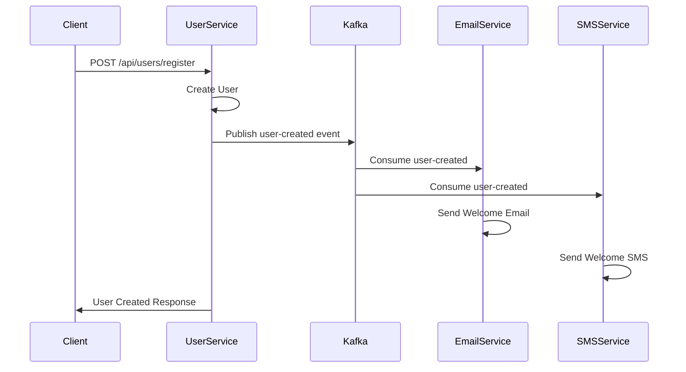
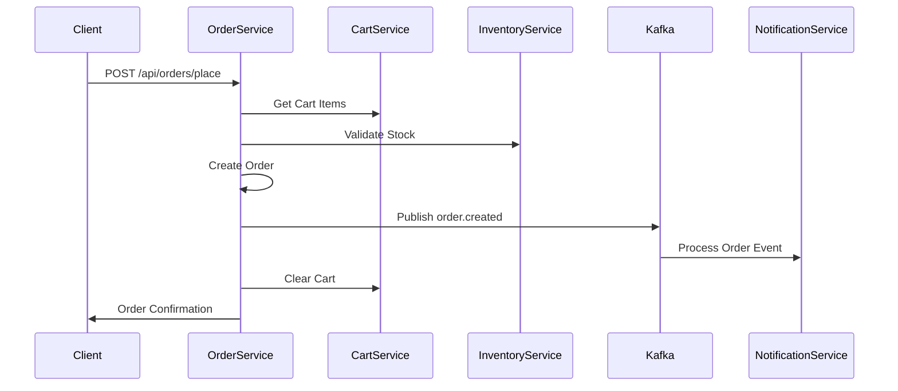

# Electronic Store - Event-Driven Microservices Architecture

## 🏗️ Architecture Overview

This is a comprehensive **Event-Driven Microservices** application for an electronic store, built with **Spring Boot** and **Apache Kafka** for real-time communication. The system demonstrates modern microservices patterns with asynchronous messaging, distributed processing, and real-time notifications.

### 🎯 Key Features
- **Event-Driven Architecture** with Apache Kafka
- **Real-time Email & SMS Notifications**
- **Distributed Order Processing**
- **Inventory Management with Validation**
- **Microservices Communication via REST & Events**
- **Docker-based Kafka Setup**
- **Caching & Performance Optimization**

---

## 🐳 Docker Infrastructure

### Kafka Setup
The application uses Docker Compose to run Kafka infrastructure:

```yaml
# docker-compose.yml
services:
  zookeeper:
    image: confluentinc/cp-zookeeper:7.6.0
    ports: ["2181:2181"]
    
  kafka:
    image: confluentinc/cp-kafka:7.6.0
    ports: ["9092:9092"]
    depends_on: [zookeeper]
    
  kafka-ui:
    image: provectuslabs/kafka-ui:latest
    ports: ["8088:8080"]
    depends_on: [kafka]
```

**To start Kafka:**
```bash
docker-compose up -d
```

**Access Kafka UI:** http://localhost:8088

---

## 🏢 Microservices Architecture

### Core Business Services

| Service | Port | Purpose | Key Features |
|---------|------|---------|--------------|
| **user-service** | 8081 | User Management | Authentication, User CRUD, User Events |
| **product-service** | 8087 | Product Catalog | Product CRUD, Category Management |
| **cart-service** | 8091 | Shopping Cart | Cart Management, Item Operations |
| **order-service** | 8085 | Order Processing | Order Creation, Status Management |
| **InventoryService** | 8090 | Inventory Control | Stock Validation, Reservation |
| **PaymentService** | 8092 | Payment Processing | Payment Validation, Transactions |
| **ShippingService** | 8093 | Shipping & Delivery | Shipping Management, Tracking |

### Notification Services

| Service | Port | Purpose | Integration |
|---------|------|---------|-------------|
| **NotificationService** | 8094 | Notification Orchestration | Kafka Consumer for Order Events |
| **email-notification-service** | 8095 | Email Notifications | JavaMailSender, SMTP Integration |
| **sms-notification-service** | 8096 | SMS Notifications | Twilio API Integration |

### Support Services

| Service | Port | Purpose |
|---------|------|---------|
| **category-service** | 8088 | Product Categories |
| **audit-service** | 8089 | System Auditing |
| **common-id-generator** | 8096 | Centralized ID Generation |

---

## 📡 Event-Driven Communication

### Kafka Topics & Event Flow

#### User Lifecycle Events
```
user-created → email-notification-service (Welcome Email)
            → sms-notification-service (Welcome SMS)

user-updated → email-notification-service (Profile Update Email)

user-deleted → email-notification-service (Goodbye Email)
```

#### Order Processing Events
```
order.created → InventoryService (Stock Validation)
             → PaymentService (Payment Processing)
             → NotificationService (Order Confirmation)

order.shipped → NotificationService (Shipping Notification)
             → email-notification-service (Shipping Email)

order.cancelled → NotificationService (Cancellation Notice)
               → InventoryService (Stock Release)

order.completed → order-service (Status Update)
```

#### Order Item Events
```
order.item.shipped → NotificationService (Item Shipped)
order.item.cancelled → InventoryService (Stock Adjustment)
```

### Consumer Groups
- **email-group**: Email notification consumers
- **sms-group**: SMS notification consumers  
- **notification-group**: General notification consumers
- **order-group**: Order processing consumers

---

## 🔄 Real-Time Workflow Examples

### 1. User Registration Flow


### 2. Order Processing Flow


---

## 📧 Notification System Details

### Email Notification Service
**Technology**: Spring Mail with JavaMailSender

**Supported Events**:
- User Registration Welcome Email
- Profile Update Confirmation
- Account Deletion Notice

**Configuration**:
```properties
spring.mail.host=smtp.gmail.com
spring.mail.port=587
spring.mail.username=${EMAIL_USERNAME}
spring.mail.password=${EMAIL_PASSWORD}
```

**Key Components**:
- `EmailNotificationListener`: Kafka consumer for user events
- `EmailUtils`: Email sending utility with HTML support

### SMS Notification Service
**Technology**: Twilio API Integration

**Supported Events**:
- User Registration Welcome SMS

**Configuration**:
```properties
twilio.account-sid=${TWILIO_ACCOUNT_SID}
twilio.auth-token=${TWILIO_AUTH_TOKEN}
twilio.from-number=${TWILIO_PHONE_NUMBER}
```

**Key Components**:
- `SmsNotificationListener`: Kafka consumer for user events
- `TwilioConfig`: Twilio client initialization
- `TwilioProperties`: Configuration properties

---

## 🛠️ Technical Implementation

### Event Publishing Pattern
```java
@Component
@RequiredArgsConstructor
public class OrderEventPublisher {
    private final KafkaTemplate<String, Object> kafkaTemplate;
    
    public void publishOrderCreatedEvent(Order order) {
        OrderCreatedEvent event = modelMapper.map(order, OrderCreatedEvent.class);
        kafkaTemplate.send("order.created", event);
    }
}
```

### Event Consumption Pattern
```java
@Component
@KafkaListener(topics = "user-created", groupId = "email-group")
public void handleUserCreated(UserCreatedEvent event) {
    String subject = "Welcome to our platform";
    String body = "<h3>Hi " + event.getFirstName() + ",</h3>" +
                  "<p>Welcome to our application!</p>";
    emailUtils.sendEmail(event.getEmail(), subject, body);
}
```

### HTTP Client Communication
```java
@HttpExchange
public interface ProductHttpClient {
    @GetExchange("/{id}")
    ApiResponse<ProductResponse> getProductById(@PathVariable String id);
}
```

---

## 🚀 Getting Started

### Prerequisites
- Java 17+
- Docker & Docker Compose
- Maven 3.6+

### Setup Instructions

1. **Start Kafka Infrastructure**
   ```bash
   docker-compose up -d
   ```

2. **Configure Email Service** (Optional)
   ```bash
   export EMAIL_USERNAME=your-email@gmail.com
   export EMAIL_PASSWORD=your-app-password
   ```

3. **Configure SMS Service** (Optional)
   ```bash
   export TWILIO_ACCOUNT_SID=your-account-sid
   export TWILIO_AUTH_TOKEN=your-auth-token
   export TWILIO_PHONE_NUMBER=your-twilio-number
   ```

4. **Start Services** (Recommended order)
   ```bash
   # Core Services First
   cd common-id-generator && mvn spring-boot:run &
   cd user-service && mvn spring-boot:run &
   cd product-service && mvn spring-boot:run &
   cd category-service && mvn spring-boot:run &
   
   # Business Services
   cd cart-service && mvn spring-boot:run &
   cd InventoryService && mvn spring-boot:run &
   cd order-service && mvn spring-boot:run &
   
   # Notification Services
   cd email-notification-service && mvn spring-boot:run &
   cd sms-notification-service && mvn spring-boot:run &
   cd NotificationService && mvn spring-boot:run &
   
   # Payment & Shipping
   cd PaymentService && mvn spring-boot:run &
   cd ShippingService && mvn spring-boot:run &
   ```

### Testing the System

1. **Create a User**
   ```bash
   curl -X POST http://localhost:8081/api/users \
   -H "Content-Type: application/json" \
   -d '{
     "firstName": "John",
     "lastName": "Doe", 
     "email": "john@example.com",
     "phoneNumber": "+1234567890"
   }'
   ```
   *Expected: Welcome email and SMS sent*

2. **Place an Order**
   ```bash
   curl -X POST http://localhost:8085/api/orders/place \
   -H "Content-Type: application/json" \
   -d '{
     "userId": "user-id",
     "items": [...]
   }'
   ```
   *Expected: Order processing events triggered*

---

## 📊 Monitoring & Observability

### Kafka UI
- **URL**: http://localhost:8088
- **Features**: Topic monitoring, message inspection, consumer group tracking

### Application Logs
Each service provides structured logging with emojis for easy identification:
- 🚀 API requests
- 📧 Email notifications  
- 📱 SMS notifications
- 📦 Order processing
- ✅ Success operations
- ❌ Error conditions

### Health Checks
All services expose Spring Boot Actuator endpoints:
```bash
curl http://localhost:8081/actuator/health
```

---

## 🔧 Configuration

### Service Ports
- User Service: 8081
- Product Service: 8087  
- Cart Service: 8091
- Order Service: 8085
- Inventory Service: 8090
- Email Notification: 8095
- SMS Notification: 8096
- Kafka UI: 8088

### Kafka Configuration
- Bootstrap Servers: localhost:9092
- Zookeeper: localhost:2181

---

## 🏆 Best Practices Implemented

1. **Event-Driven Architecture**: Loose coupling via Kafka events
2. **Microservices Patterns**: Single responsibility, independent deployment
3. **Resilience**: Retry mechanisms, circuit breakers, graceful degradation
4. **Performance**: Caching with Caffeine, async processing
5. **Observability**: Structured logging, health checks
6. **Security**: Input validation, error handling
7. **Scalability**: Horizontal scaling support, load balancing ready

---

## 🤝 Contributing

1. Fork the repository
2. Create feature branch (`git checkout -b feature/amazing-feature`)
3. Commit changes (`git commit -m 'Add amazing feature'`)
4. Push to branch (`git push origin feature/amazing-feature`)
5. Open a Pull Request

---

## 📝 License

This project is licensed under the MIT License - see the [LICENSE](LICENSE) file for details.

---

## 📞 Support

For questions and support:
- Create an issue in the repository
- Contact the development team
- Check the application logs for troubleshooting

---

**Happy Coding! 🎉**
